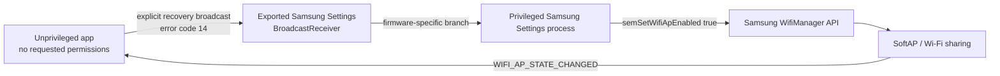

# Implementation

## Trust boundary

The app does not call hidden hotspot APIs directly. That would fail for a normal
application because the required network-stack or system permissions are absent.
Instead, the exported Samsung Settings receiver accepts the explicit broadcast,
and the already privileged Settings process performs the operation.

## Start sequence

1. The app checks that the receiver and warning activity exist and are exported.
2. It sends an explicit broadcast to:
   `com.samsung.android.settings/.wifi.mobileap.WifiApBroadcastReceiver`.
3. The action is
   `com.samsung.android.net.wifi.WIFI_AP_DRIVER_STATE_HANGED`.
4. The integer extra `wifi_ap_error_code` is set to `14`.
5. On the verified firmware, the receiver marks provisioning as accepted and calls
   the Samsung Wi-Fi manager's privileged enable method.

This value is firmware-specific. In AOSP, `wifi_ap_error_code` is a failure-reason
field, while `14` is also used for the `WIFI_AP_STATE_FAILED` state. That mismatch
is why the project treats this as a narrow legacy firmware behavior rather than a
documented Android API.

## State detection

The activity registers for the sticky
`android.net.wifi.WIFI_AP_STATE_CHANGED` broadcast and reads `wifi_state`:

| Value | Meaning |
| --- | --- |
| `10` | Disabling |
| `11` | Disabled |
| `12` | Enabling |
| `13` | Enabled |
| `14` | Failed |

If the sticky broadcast is unavailable, the app checks whether Samsung's `swlan0`
hotspot interface is up. An eight-second timeout prevents an incompatible firmware
from leaving the interface permanently stuck on “Starting.”

## Stop sequence

The direct hidden Wi-Fi API is not available to this unprivileged app. To stop the
hotspot, it launches the exported Samsung Settings activity
`com.samsung.android.settings.wifi.WifiWarning` with `req_type=1` and
`extra_type=1`. On the verified build, Settings calls the privileged disable method.
The first use may show a Samsung-owned confirmation dialog depending on saved
Settings preferences.

## Why `tether_dun_required=0` is different

`settings put global tether_dun_required 0` only changes a framework setting. It
does not guarantee that a carrier-customized Samsung provisioning activity will
allow no-SIM Wi-Fi sharing. This project targets a separate Settings component
path observed on the verified firmware.

## References

- [AOSP Android 8 `WifiManager`](https://android.googlesource.com/platform/frameworks/base/+/android-8.0.0_r21/wifi/java/android/net/wifi/WifiManager.java)
- [Older S8-family receiver example](https://github.com/GrifoDev/BatMan-ModdedFiles/blob/09d6d1a324c3b0ee2ac01dcc68e238e6e7b229c4/SecSettings/smali_classes2/com/samsung/android/settings/wifi/mobileap/WifiApBroadcastReceiver.smali)
- [Older Note8 receiver example](https://github.com/GrifoDev/IronMan-ModdedFiles/blob/b2b360030432d5150239f45b61eda15b8c9c3af2/SecSettings/smali_classes2/com/samsung/android/settings/wifi/mobileap/WifiApBroadcastReceiver.smali)
